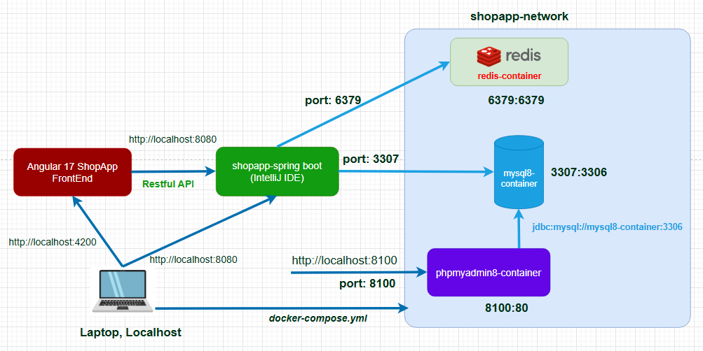

# 🛍️ Shopping App Backend

This is a Spring Boot based REST API for a shopapp application, 
providing product management, order processing, user management, 
and more.

## 🚀 Features
- Managing products, orders, coupon, cart items, users and more.
- Integrating Vnpay (sandbox mode).
- Normal login, Social login (Google and Facebook)
- Granting privileges for user and admin.
- Swagger/OpenAPI documentation.

## 🛠️ Tech Stack
- Java 21
- Spring Boot 3, Spring Security 6, OAuth2 OpenID.
- Database: MySQL, Redis-Redisson.
- Swagger/OpenAPI,
- Flyway migration. 
- Docker, docker-compose.

## 🧪 How to Run
Running on localhost environment, we also combine to containers as MySql, phpmyadmin, Redis.

### Prerequisites
- Resource from this GitHub repository.
- JDK 21.
- Maven.
- Docker.

### Setup

1. Clone the repository:
   ```` bash
   git clone https://github.com/vanhaidl93/shopapp-backend.git
   ````
   
2. Run containers:
    ```` bash
   cd shopapp-backend/shopapp-compose
   docker-compose up -d
   ````
   
3. Import database into phpmyadmin8:
    ```` bash
   shopapp-backend/sql_script/shopapp.sql
   ````

4. Run the application:
   ```` bash
   cd shopapp-backend
   mvnw spring-boot:run
   ````

5. Interact REST API:
- Swagger UI
   ```` bash
   http://localhost:8080/swagger-ui/index.html
   ````
- importing file into **Postman**.
    ```` bash
    ./shopapp-postman/shopapp.postman.json
    ````
- combine **Front End** (Angular 17) for demo
   ```` bash
  https://github.com/vanhaidl93/shopapp-frontend.git
  ````
  
## 📦 shopapp-architecture:


